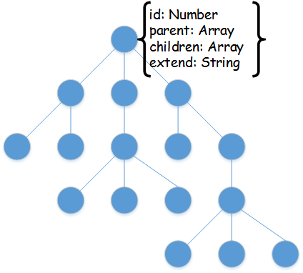
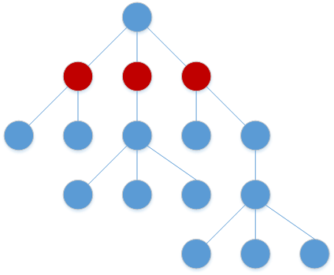
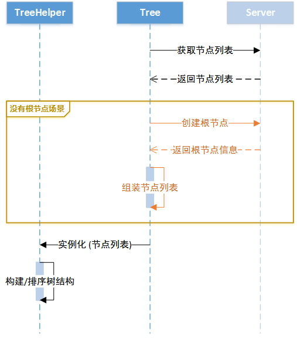
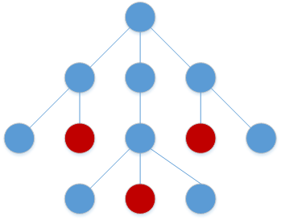
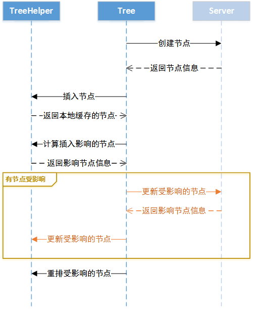
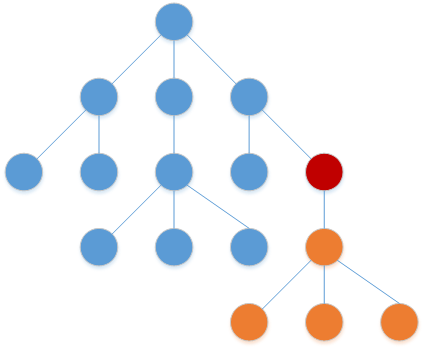
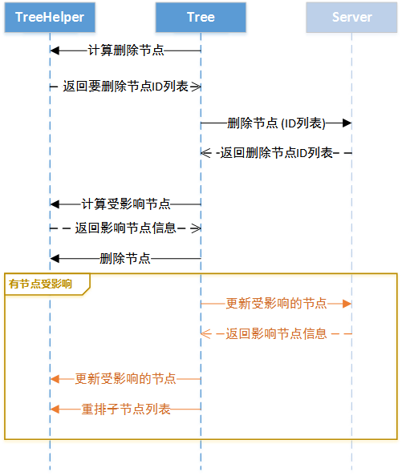

# 数据层基类说明文档

## 组件状态

[](https://g.hz.netease.com/edu-frontend/cache-base/commits/master)


## pool/cache-base/src/base

云课堂所有数据层的基类，封装的内容包括：

* 列表的 CRUD 操作及排序操作
* 统一导入、导出、下载方案的封装
* 统一带请求队列锁、带缓存、带轮询方案的封装
* 公共功能如取二维码等接口的封装

数据层的生成采用统一的 [教育产品前端缓存规范](https://g.hz.netease.com/edu-frontend/edu-front-doc/blob/master/4.Manual/Cache.md)

## pool/cache-base/src/setting

云课堂所有数据、组件、模块的配置中心，所有通用池的数据层、组件、模块默认都会在配置中心增加各自的配置项，业务线通过重写覆盖配置来调整通用池的功能

使用范例

```javascript
    NEJ.define([
       'pool/cache-base/src/setting'
    ],function(setting){
       // 批量更新设置
       setting.batch({
           "component-ui-abc": {
               "funcABC": true
           },
           "component-ui-def": {
               "funcDEF": true
           }
       });
      // 取设置配置信息
      var set = setting.get("component-ui-abc");
    });
```

## pool/cache-base/src/tree

通用树形结构数据模型统一解决方案，树的模型范例如下图所示



* 取树节点列表

在获取树形结构的数据模型时后端只需要返回节点的列表即可，树形结构的组装由前端来完成，当使用数据层通用的 _$getListInCache 接口时返回的是第一层子节点列表

如果取树节点的过程中没有返回树的根节点，则会先通过插入节点的方式请求服务器生成一个根节点



树的组装过程中各角色的协作过程



* 插入节点

树的节点只能做为叶子节点插入到已有的树形结构中



插入节点过程中各角色的协作过程



* 更新节点

树节点的更新可以应用到所有节点，更新时可以批量更新多个节点，每个节点输入需要更新的字段信息


更新节点过程中各角色的协作过程


* 删除节点

树节点的删除会同时删除该节点下的所有子节点



删除节点过程中各角色的协作过程



* 移动节点


