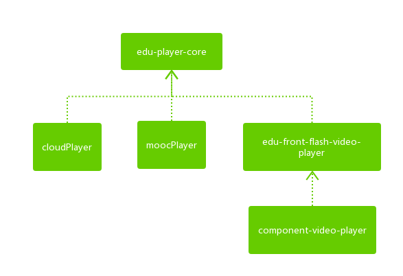

# 教育产品播放器工程、版本和使用信息统计

## 视频播放器工程
- 备注：flash工程编译出的swf文件需要使用js封装一下方便使用

### edu-player-core
- git 地址：https://git4u.hz.netease.com/edu-front/edu-player-core
- 说明：flash库工程，编译出swc。cloudPlayer、moocPlayer、edu-audio-player都依赖该工程。该工程升级后，其他依赖该工程的工程需要重新编译。暂无rtmp直播功能。
- 功能点：
	- 视频（音频）对象抽象
	- 播放器配置管理
	- 非加密视频（flv、MP4）播放功能
	- 加密视频（flv）播放功能
	- 音频（mp3）播放功能
	- 播放相关方法、事件的封装
	- 日志功能（比较简单，需要优化）
	- 一些工具方法

### cloudPlayer
- git 地址：https://git4u.hz.netease.com/edu-front/cloud-player
- 说明：云课堂和专题使用。flash工程，编译出swf。
- 功能点：
	- 基本播放界面：封面、控制条等
	- PPT和视频混播功能
	- 字幕功能
	- 截图功能（目前已经不可用）

### moocPlayer
- git 地址：https://git4u.hz.netease.com/edu-front/imooc-player
- 说明：yooc和中M使用。flash工程，编译出swf。
- 功能点：
	- 基本播放界面：封面、控制条等
	- 字幕功能
	- 片头广告和暂停广告功能
	- 有两套ui资源（yooc和mooc）：比如颜色、logo上有差异

### html5-video-player
- git 地址：无
- 说明：旧的h5播放器，目前只有中M在用，没有适配移动端。之后将废弃，统一使用component-video-player中的h5播放器。
- 功能点：
	- 基本播放功能和界面：封面、控制条等
	- 字幕功能

	

### component-video-player
- git 地址：https://g.hz.netease.com/edu-frontend/component-video-player
- 说明：最新的通用视频播放器组件。js封装了swf和h5播放器，可以根据视频和平台进行自动判断。
- 功能点：
	- 自动判断系统和视频，判断使用h5还是flash
	- h5播放器功能点：1. 基本播放功能和界面：封面、控制条等。2. 可以自动适配移动端。3. 并且支持直播模式和native模式。4. 片头广告功能（仅web端）。5. 字幕功能
	- flash播放器功能点见edu-front-flash-video-player

### edu-front-flash-video-player
- git 地址：https://g.hz.netease.com/edu-frontend/edu-front-flash-video-player
- 说明：最新的通用flash视频播放器，flash工程，编译出swf，供component-video-player使用
- 功能点：
	- 基本播放功能和界面：封面、控制条等
	- 片头广告和暂停广告功能
	- 字幕功能

### 视频播放器工程关系图：

## 音频播放器工程
### edu-audio-player
- git 地址：https://git4u.hz.netease.com/edu-front/edu-audio-player
- 说明：flash工程，编译出swf
- 功能点：
	- 仅音频播放功能、方法、事件。没有界面

### component-audio-player
- git 地址：https://g.hz.netease.com/edu-frontend/component-audio-player
- 说明：js封装了swf。swf由edu-audio-player提供。目前还在开发中
- 功能点：暂无

## pdf播放器工程
### pdfReader
- git 地址：https://git4u.hz.netease.com/edu-front/edu-flash-flashPdfReader
- 说明：flash工程，编译出swf
- 功能点：
	- swf pdf文件播放功能
	- 翻页、全屏等界面功能
	- 相关事件

### component-pdf-player
- git 地址：https://g.hz.netease.com/edu-frontend/component-pdf-reader
- 说明：js封装了pdfReader编译的swf
- 功能点：与pdfReader一致

## 各个工程和场景中视频播放器的使用情况
| 产品             |web端播放器和版本     | 适配页播放器和版本  |
| :-------------- | :------------ | :------------ | 
|云课堂1.0         | cloudPlayer 1.6.18    | video标签      |           
|云课堂1.0专题      | cloudPlayer 1.6.18  | video标签      |     
|yooc			     | moocPlayer 1.7.25   |video标签       |  
|中M			     | moocPlayer 1.7.25和html5-video-player   | video标签 |
|中M专题           | moocPlayer 1.7.25   | video标签       |  
|企业云            |component-video-player 0.0.13|component-video-player 0.0.13| 
|k12              |component-video-player 0.0.13|component-video-player 0.0.13| 

- 统计时间截止：2016-11-28
- 备注：除了component-video-player外，其他的播放器是由具体产品去封装的

## 音频播放器使用情况
- 统计时间截止：2016-11-28
- 目前只有云课堂有使用音频播放器，云课堂工程中的习题听力播放器和IM中的语音消息使用了edu-audio-player中的swf，云课堂自己封装。后续会逐步改为使用component-audio-player，里面做了封装，自动判断使用flash或者h5，这个还在开发中

## pdf播放器使用情况
| 产品             | 播放器和版本           |
| :-------------- | :--------------------| 
|云课堂1.0         | pdfReader   			 | 
|yooc			     | pdfReader 		    |
|中M			     | pdfReader 		    | 
|企业云        	 | pdfReader            | 
- 统计时间截止：2016-11-28
- 备注：目前都是直接使用swf，产品自己封装。后续会逐步改为使用component-pdf-player，里面做了封装。pdf暂时只有swf版