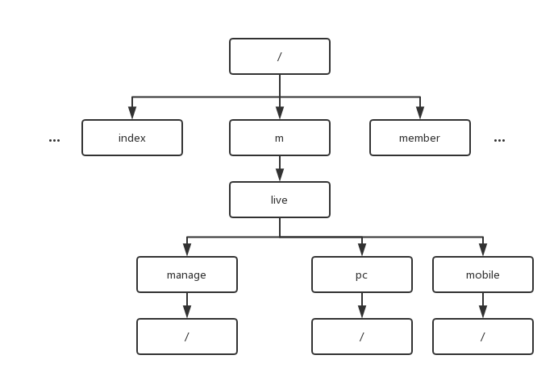
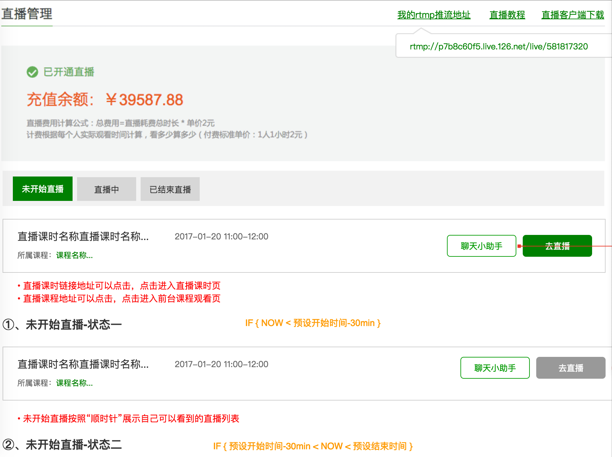
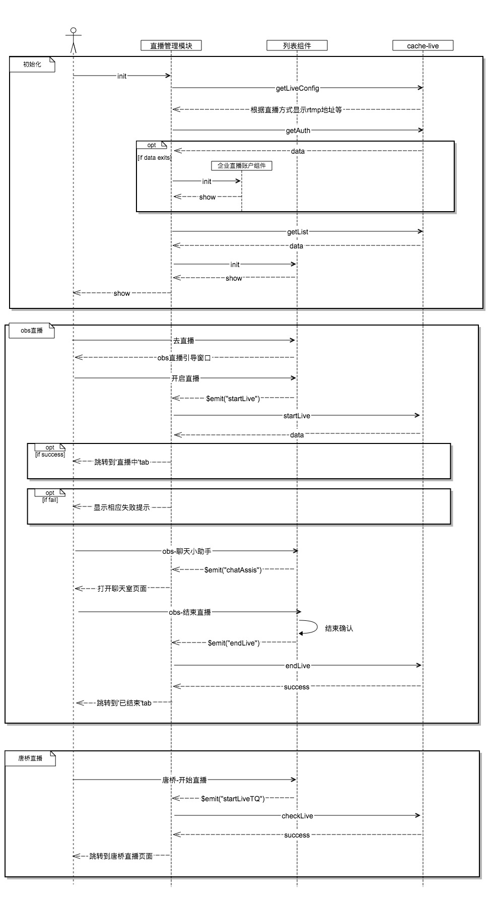

# Live 模块

## 模块状态

## 模块设计

## web端直播间模块

| 字段 | 描述 |
| :---- | :---- |
| 模块UMI | /m/live/pc/ |
| 模块别名 | live-pc |
| 模块功能 |  |
| 模块时序图 | |

模块输入参数

| 参数 | 描述 |
| :---- | :---- |
|  | |

## 移动适配端直播间模块

| 字段 | 描述 |
| :---- | :---- |
| 模块UMI | /m/live/mobile/ |
| 模块别名 | live-mobile |
| 模块功能 |  |
| 模块时序图 | |

模块输入参数

| 参数 | 描述 |
| :---- | :---- |
|  | |

## 管理中心直播管理模块

| 字段 | 描述 |
| :---- | :---- |
| 模块UMI | /m/live/manage/ |
| 模块别名 | live-manage |
| 模块功能 |  |
| 模块时序图 | |

模块输入参数

| 参数 | 描述 |
| :---- | :---- |
|  | |
